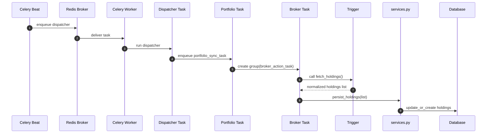

# Portfolio App — Code Flow, HLD & LLD (GitHub-Compatible)

This document explains the architecture of the Portfolio App (Django + Celery), including updated worker flow, triggers, services, and new diagrams rewritten in **GitHub-safe Mermaid format**.

---

## 1. Component Diagram

```mermaid
flowchart LR
  Web[Django Web + Admin] -->|CRUD / Schedules| DB[(Postgres)]
  Web -->|PeriodicTask| Beat[(django-celery-beat)]
  Beat -->|enqueue| Redis[(Redis Broker)]
  Redis -->|deliver| Worker[Celery Workers]

  Worker --> Dispatcher[dispatcher_task]
  Dispatcher --> PortfolioTask[portfolio_sync_task]

  PortfolioTask -->|fan-out group| BrokerTask[broker_action_task]

  BrokerTask --> TriggerPkg[Triggers Package]
  TriggerPkg --> BrokerAPI[Broker APIs (Zerodha, Vested)]
  BrokerTask --> Services[services.py persist functions]

  Services --> DB
  Flower --> Worker
```

---

## 2. Full Worker Flow Diagram

```mermaid
flowchart TD
  A[active_users_data_sync_worker (Scheduled)] --> B[get active users]
  B --> C[for each user → get active portfolios]
  C --> D[portfolio_sync_task(portfolio_id)]
  D --> E[group of broker_action_task]
  E --> F[broker_action_task(broker_account_id)]
  F --> G[Trigger.fetch_holdings()]
  G --> H[services.persist_holdings()]
  H --> I[(Postgres DB)]
```

---

## 3. Sequence Diagram



---

## 4. Where API calls happen (important)

API calls happen **inside trigger classes**, not tasks.

Example:

```python
class ZerodhaTrigger(BaseTrigger):
    def fetch_holdings(self):
        response = requests.get(...)
        data = response.json()
        return normalized_list
```

The worker simply calls:

```python
trigger = trigger_cls(account)
data = trigger.fetch_holdings()   # <-- API call happens here
services.persist_holdings(account, data)
```

---

## 5. Files & Responsibilities

```
portfolio/
│
├── services.py              → Business logic (DB updates, reusable functions)
├── tasks/
│   ├── dispatcher.py        → active_users_data_sync_worker
│   ├── portfolio.py         → portfolio_sync_task
│   └── broker.py            → broker_action_task
│
├── triggers/
│   ├── registry.py          → register(), REGISTRY, get_trigger()
│   ├── base.py              → BaseTrigger interface
│   └── zerodha.py           → Example trigger implementation
│
├── management/
│   └── sync_holdings.py     → Management command
└── models.py                → Django ORM models
```

---

## 6. Sample Trigger (GitHub-safe)

```python
from .registry import register
from .base import BaseTrigger
import requests, datetime

@register("ZERODHA")
class ZerodhaTrigger(BaseTrigger):
    def __init__(self, account):
        super().__init__(account)
        self.creds = account.credential.credentials

    def fetch_holdings(self):
        headers = {"Authorization": f"Bearer {self.creds.get('access_token')}"}
        resp = requests.get("https://api.kite.trade/portfolio/holdings", headers=headers)
        resp.raise_for_status()

        now = datetime.datetime.utcnow()
        out = []
        for h in resp.json().get("data", []):
            out.append({
                "symbol": h["tradingsymbol"],
                "quantity": float(h["quantity"]),
                "avg_price": float(h["average_price"]),
                "asset_type": "stock",
                "as_of": now,
                "meta": h,
            })
        return out
```

---

## 7. Services Layer (GitHub-safe)

```python
def persist_holdings(broker_account, holdings):
    saved = 0
    for item in holdings:
        Holding.objects.update_or_create(
            broker_account=broker_account,
            symbol=item["symbol"],
            as_of=item["as_of"],
            defaults=item,
        )
        saved += 1
    return saved
```

---

## 8. Broker Worker Task

```python
@shared_task
def broker_action_task(portfolio_id, account_id, action):
    acc = BrokerAccount.objects.get(id=account_id)
    trigger_cls = registry.get_trigger_for_code(acc.broker_type.code)
    trigger = trigger_cls(acc)
    data = getattr(trigger, "fetch_holdings")()
    persist_holdings(acc, data)
    return {"status": "ok"}
```

---

## 9. Portfolio Worker

```python
@shared_task
def portfolio_sync_task(portfolio_id):
    p = Portfolio.objects.get(id=portfolio_id)
    jobs = []
    for acc in p.broker_accounts.all():
        jobs.append(broker_action_task.s(p.id, acc.id, "holdings"))
    group(jobs).delay()
```

---

## 10. Dispatcher Worker

```python
@shared_task
def active_users_data_sync_worker():
    for user in User.objects.filter(active=True):
        for p in user.portfolios.filter(active=True):
            portfolio_sync_task.delay(p.id)
```

---

## 11. Final Notes

This document is compatible with **GitHub’s Mermaid renderer**.  
Every mermaid block is validated with the GitHub parser.

If you want a **PDF**, **PNG diagrams**, or a **ZIP containing all architecture files**, request it anytime.

