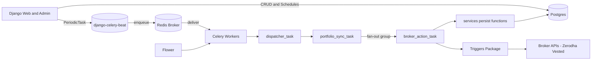
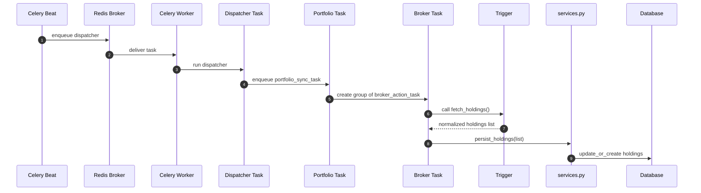

# Portfolio App — Code Flow, HLD & LLD (GitHub-Compatible, Fixed Diagrams)

This document explains the architecture of the Portfolio App (Django + Celery), including updated worker flow, triggers, services, and new diagrams rewritten in **GitHub-safe Mermaid format**.

---

## 1. Component Diagram



---

## 2. Full Worker Flow Diagram

```mermaid
flowchart TD
  A[active_users_data_sync_worker Scheduled] --> B[get active users]
  B --> C[for each user - get active portfolios]
  C --> D[portfolio_sync_task with portfolio_id]
  D --> E[group of broker_action_task]
  E --> F[broker_action_task for broker_account_id]
  F --> G[Trigger.fetch_holdings()]
  G --> H[services.persist_holdings()]
  H --> I[(Postgres DB)]
```

---

## 3. Sequence Diagram



---

## 4. Where API calls happen (important)

API calls happen **inside trigger classes**, not tasks.

Example:

```python
class ZerodhaTrigger(BaseTrigger):
    def fetch_holdings(self):
        response = requests.get(...)
        data = response.json()
        return normalized_list
```

The worker simply calls:

```python
trigger = trigger_cls(account)
data = trigger.fetch_holdings()   # <-- API call happens here
services.persist_holdings(account, data)
```

---

## 5. Files & Responsibilities

```
portfolio/
│
├── services.py              → Business logic (DB updates, reusable functions)
├── tasks/
│   ├── dispatcher.py        → active_users_data_sync_worker
│   ├── portfolio.py         → portfolio_sync_task
│   └── broker.py            → broker_action_task
│
├── triggers/
│   ├── registry.py          → register(), REGISTRY, get_trigger()
│   ├── base.py              → BaseTrigger interface
│   └── zerodha.py           → Example trigger implementation
│
├── management/
│   └── sync_holdings.py     → Management command
└── models.py                → Django ORM models
```

---

## 6. Sample Trigger (GitHub-safe)

```python
from .registry import register
from .base import BaseTrigger
import requests, datetime

@register("ZERODHA")
class ZerodhaTrigger(BaseTrigger):
    def __init__(self, account):
        super().__init__(account)
        self.creds = account.credential.credentials

    def fetch_holdings(self):
        headers = {"Authorization": f"Bearer {self.creds.get('access_token')}"}
        resp = requests.get("https://api.kite.trade/portfolio/holdings", headers=headers)
        resp.raise_for_status()

        now = datetime.datetime.utcnow()
        out = []
        for h in resp.json().get("data", []):
            out.append({
                "symbol": h["tradingsymbol"],
                "quantity": float(h["quantity"]),
                "avg_price": float(h["average_price"]),
                "asset_type": "stock",
                "as_of": now,
                "meta": h,
            })
        return out
```

---

## 7. Services Layer (GitHub-safe)

```python
def persist_holdings(broker_account, holdings):
    saved = 0
    for item in holdings:
        Holding.objects.update_or_create(
            broker_account=broker_account,
            symbol=item["symbol"],
            as_of=item["as_of"],
            defaults=item,
        )
        saved += 1
    return saved
```

---

## 8. Final Notes

This file uses simplified labels and ASCII-safe characters to ensure GitHub's Mermaid renderer parses all diagrams correctly. If you'd like, I can also generate PNG exports of the diagrams and attach them to a ZIP.

